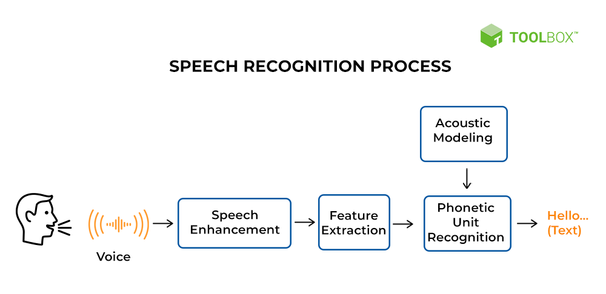

# Speech-Recognition

## Introduction
What is Speech Recognition:

Speech recognition, also known as automatic speech recognition (ASR) or voice recognition, is a technology that converts spoken language into written text.

Here are the key steps in a short summary:

**Acquisition of Audio Input:** Capture audio signals using a microphone or other recording device.

**Preprocessing:** Clean and preprocess the audio data to enhance signal quality, removing noise or distortions.

**Feature Extraction:** Extract relevant features from the audio signal, such as spectral features or Mel-frequency cepstral coefficients (MFCCs).

**Model Training:** Train a speech recognition model using machine learning algorithms, often deep neural networks, on a labeled dataset containing pairs of audio samples and their corresponding transcriptions.

**Decoding:** Apply the trained model to decode or transcribe the input audio into text.

**Post-processing:** Refine the transcription results, applying techniques such as language modeling or context-aware algorithms.

**Output:** Obtain the final transcribed text as the output of the speech recognition system.

Speech recognition is used in various applications, including voice assistants, transcription services, and hands-free operation of devices.

## What is Covered in this notebook:

### 1) Speech Recognition-speech to text, text to speech and translation:

a) Capture spoken audio and display the transcription(predicted text)

b) Enrich audio by volume and background nosie adjustments

c) Compare transcription to actual text.Utilize WER score.

d) Translate the transcribed text into another language(French and Turkish).

e) Listen to the audio of translated text

### 2) Speech Recognition-prediction of gender from audio files:

a) Visualize audio files for key indicators for gender recognition.

b) Extract key features from audio files to input into model training.

c) Train and evaluate a neural network model to predict the gender for audio files.

We are provided with many short audio files to be used for this project. For our translation section, we will only use handful of these files to showcase and for gender prediction, we will
be using a subset(10,000) of the training data that is provided. A separate csv file is provided that has the audio file names, actual spoken text, gender, age of speaker and few other 
datapoints to assist with the project. 

This notebook uses common-voice dataset from Kaggle, if you want, you can download the dataset from Kaggle and then run it on google colab or on jupyter notebook. Don't hesistate to reach 
out if you have any questions. 

Happy Learning! :)
